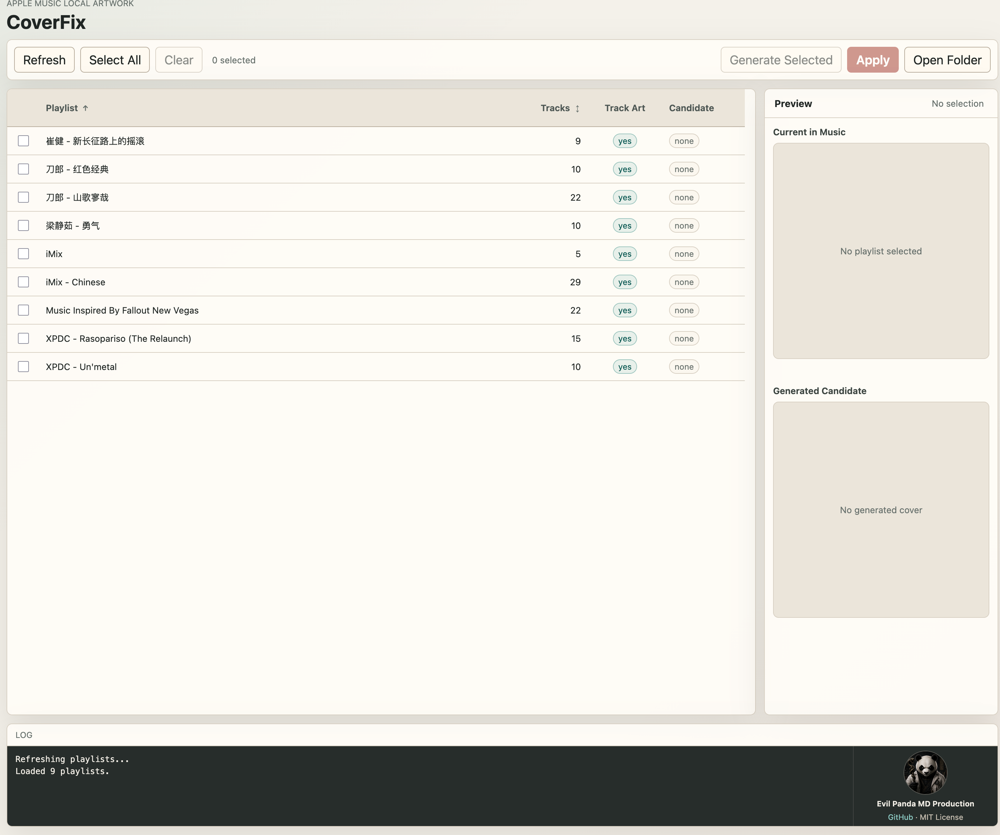

# CoverFix

CoverFix is a small Python tool for fixing missing, blank, or broken Apple Music playlist covers on macOS.

CoverFix 是一个用于修复 Apple Music 播放列表封面丢失、空白、不同步问题的 Python 小工具。

GitHub: https://github.com/EinProfispieler/coverfix


## Screenshot



## What problem does it solve?

Apple Music / Music.app on macOS may sometimes show broken playlist artwork.

Common cases:

- Playlist covers disappear
- Playlist covers become blank
- Custom playlist covers do not refresh
- Playlist covers show correctly on Mac but not on iPhone / iPad
- Some playlists fall back to the default generated collage cover
- Managing many playlist covers manually becomes repetitive

CoverFix focuses on this specific problem: fixing Apple Music playlist artwork.

It is not a general music tag editor. It is not designed to edit album artwork inside MP3, M4A, FLAC, or ALAC files.

## Features

- Lists normal user playlists from Apple Music.
- Generates a candidate cover from the first available track artwork in each playlist.
- Falls back to Apple catalog artwork lookup when local track artwork is not available.
- Previews the current artwork stored by Apple Music and the generated candidate side-by-side.
- Applies selected playlist covers through the local Apple Music artwork database.
- Batches selected playlists so Music quits and reopens only once per apply run.
- Provides a CLI for listing, generating, applying, diagnostics, and backup restore.

## What CoverFix is not

CoverFix is not:

- An MP3 / M4A / FLAC tag editor
- A MusicBrainz Picard replacement
- A general Apple Music manager
- A streaming metadata editor
- A tool for modifying album artwork embedded inside audio files
- An installable macOS app

CoverFix is specifically focused on Apple Music playlist covers.

## Requirements

- macOS
- Python 3.10+
- Apple Music / Music.app
- macOS command line tools available by default: `osascript`, `open`, `pkill`, and `sips`

No third-party Python package is currently required.

## Run

```bash
git clone https://github.com/EinProfispieler/coverfix.git
cd coverfix
chmod +x run.sh
./run.sh
```

The web UI opens at: <http://127.0.0.1:8765>

Or run the entry file directly:

```bash
python3 playlist_cover_helper_web.py
```

Explicitly start the web UI without opening a browser:

```bash
python3 playlist_cover_helper_web.py web --no-open
```

Legacy Tk version:

```bash
python3 playlist_cover_helper.py
```

Low-level injection helper:

```bash
python3 inject_playlist_cover.py --list
python3 inject_playlist_cover.py --pid <pid> --image /path/to/cover.jpg
```

Most users should use the web UI or `playlist_cover_helper_web.py` CLI instead of the low-level helper.

## First-launch permissions

macOS may prompt for:

- Apple Events / Automation permission for controlling Music.
- Accessibility permission if you use the legacy Tk automation flow.

If playlist listing fails, open Music manually, allow the permission prompt, and try again.

## Web workflow

1. Click **Refresh**.
2. Select one or more playlists via the checkboxes.
3. Use **Generate Selected** to inspect candidates without applying them.
4. Use **Apply** only after checking the generated cover.
5. Check **Current in Music** after Music restarts.

## CLI usage

```bash
# List all playlists (shows pid, track_count, name)
python3 playlist_cover_helper_web.py list

# Generate covers for specific playlists without modifying Music
python3 playlist_cover_helper_web.py generate --pid <pid>
python3 playlist_cover_helper_web.py generate --pid <pid1> --pid <pid2>

# Generate and apply covers in one step
python3 playlist_cover_helper_web.py apply --pid <pid>
python3 playlist_cover_helper_web.py apply --pid <pid1> --pid <pid2>

# Diagnostics
python3 playlist_cover_helper_web.py doctor
```

Get the `pid` for a playlist by running `list` first. It appears in the first column.

Generated covers are written to:

```text
~/.coverfix/covers
```

## Safety and backups

Before running tools that modify Apple Music library-related data, keep a backup of your Music library.

The `generate` command and the web **Generate Selected** button are the safest preview path. They create candidate image files but do not apply changes to Music.

The `apply` command and the web **Apply** button modify Apple Music's local artwork database at:

```text
~/Library/Containers/com.apple.AMPArtworkAgent/Data/Documents/artworkd.sqlite
```

Before applying covers, CoverFix creates timestamped backup files next to the artwork database.

## Rescue from CLI

`rescue` is intentionally CLI-only because restore is destructive.

```bash
# Inspect backups first
python3 playlist_cover_helper_web.py rescue --list

# Restore latest backup (requires --yes)
python3 playlist_cover_helper_web.py rescue --latest --yes

# Restore a specific backup timestamp
python3 playlist_cover_helper_web.py rescue --timestamp 20260512-143000 --yes
```

Restore stops Music and artwork background services, replaces `artworkd.sqlite` / `-wal` / `-shm` with backup files, and starts Music again unless `--no-restart` is provided.

Use restore only when library artwork is broken and you understand that recent artwork changes after the backup point may be lost.

## Privacy

CoverFix runs locally and does not upload music files.

When a playlist has no local track artwork available, CoverFix may query Apple's public iTunes Search API using the first track's title, artist, and album to fetch candidate artwork. See [PRIVACY.md](PRIVACY.md) for details.

## CI package

GitHub Actions creates a zip archive on pushes to `main` using a macOS runner.

- Workflow: `.github/workflows/package-macos.yml`
- Output: `CoverFix-macos-<short_sha>.zip`
- Release tag: `macos-latest`

This is a source/package zip, not a signed macOS app or App Store build.

## How it works

CoverFix talks to Apple Music via AppleScript to enumerate playlists and export artwork. When applying selected covers, it writes image references into the local `artworkd.sqlite` database used by `AMPArtworkAgent`, then restarts Music once per batch so changes take effect.

## Known limitations

- Apple Music sync behavior can be delayed.
- iCloud Music Library may take time to refresh changes on iPhone / iPad.
- Some playlist artwork issues may be caused by Apple-side caching.
- Not all playlist cover issues can be fixed instantly.
- Behavior may vary across macOS versions.
- The project focuses on playlist covers, not album artwork metadata.

## Troubleshooting

If features suddenly stop working, run:

```bash
python3 playlist_cover_helper_web.py doctor
```

If `fetch_playlists_ok` is `false`, first reboot macOS, then open Music manually and retry.

## FAQ

### Does CoverFix edit my music files?

No. CoverFix is focused on Apple Music playlist covers. It is not intended to edit embedded album artwork inside audio files.

### Is this for album artwork?

No. CoverFix is for playlist artwork.

If your issue is that a song or album has the wrong cover inside an MP3, M4A, FLAC, or ALAC file, CoverFix is probably not the right tool.

### Does it upload my music?

No. It does not upload music files. It may request artwork from Apple's public catalog fallback using basic first-track metadata when local artwork is missing.

### Why do playlist covers disappear?

Possible reasons include:

- Apple Music cache issues
- iCloud Music Library sync delays
- Custom artwork not refreshing
- Library migration between Macs
- Playlist metadata inconsistencies
- Apple-side sync behavior

CoverFix is built to help with the practical repair workflow.

## License

MIT - see [LICENSE](LICENSE).
